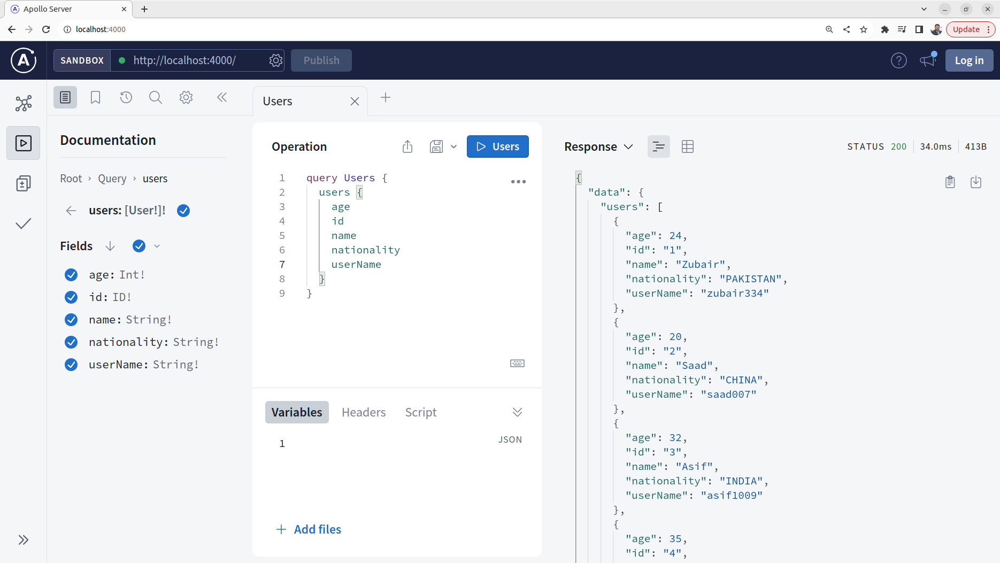

# Defining Queries Part 01

1. Follow [Creating Server](../step07b_creating_server/) before following this step. Once you have completed the last steps run the following in two different terminals

   ```bash
   tsc -w
   ```

   ```bash
   npm start
   ```

2. Update `src/schema/typeDefs.ts`. Replace already written data with the following code.

   ```ts
   export const typeDefs = `#graphql
   
      type User {
         id: ID!
         name: String!
         userName: String!
         age: Int!
         nationality: String!
      }
   
      type Query {
         users: [User!]!
      }
      
   `;
   ```

   This defines a simple GraphQL schema using the Apollo Server's syntax. The schema revolves around a primary type, `User`, representing users in the system. Each user has fields such as `id`, `name`, `userName`, `age`, and `nationality`, where `ID!` and `String!` denote non-nullable ID and string types, respectively. The `Query` type includes a single query, `users`, which returns a non-nullable array of users. The schema provides a structured blueprint for querying user data, encompassing essential details like user identification, personal information, and nationality. This serves as the foundational structure for a GraphQL API, outlining how clients can request and receive user-related data.

3. As we are not using any db for now so create some users dummy data. Create `src/data/data.ts`

   ```ts
   export const usersList = [
     {
       id: "1",
       name: "Zubair",
       userName: "zubair334",
       age: 24,
       nationality: "PAKISTAN",
     },
     {
       id: "2",
       name: "Saad",
       userName: "saad007",
       age: 20,
       nationality: "CHINA",
     },
     {
       id: "3",
       name: "Asif",
       userName: "asif1009",
       age: 32,
       nationality: "INDIA",
     },
     {
       id: "4",
       name: "Ali",
       userName: "ali123",
       age: 35,
       nationality: "USA",
     },
     {
       id: "5",
       name: "Minsa",
       userName: "minsa2020",
       age: 3,
       nationality: "CANADA",
     },
   ];
   ```

4. Now we need to define some resolver to actually be able to run the queries. Update `src/resolvers/resolvers.ts`. Replace already written data with the following code.

   ```ts
   import { usersList } from "../data/data.js";

   export const resolvers = {
     Query: {
       users: () => usersList,
     },
   };
   ```

   The resolvers object has a `Query` field, specifying a resolver function for the `users` query. When the users query is executed, the resolver retrieves data from an external source, in this case, the usersList. The resolver simply returns the usersList, which presumably contains an array of user objects. In GraphQL, resolvers are responsible for fetching the requested data, and here, the users resolver ensures that when the users query is made, it responds with the list of users from the data source. This connection between the schema and the data source is crucial for fulfilling GraphQL queries with actual data.

5. Navigate to http://localhost:4000/ in the browser, This time you will be able to run the query

   
