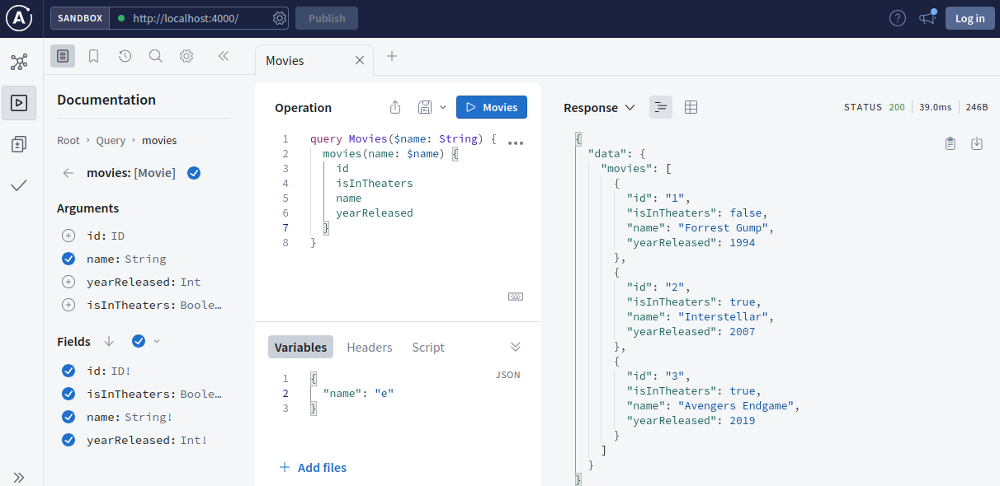

# Defining Queries Part 03

1. Once you have completed [Defining Queries 02](../step07d_defining_queries_resolvers_02) run the following in two different terminals

   ```bash
   tsc -w
   ```

   ```bash
   npm start
   ```

2. Update `src/schema/typeDefs.ts`. Add follwoing type to the already defined schema

   ```graphql
   type Movie {
     id: ID!
     name: String!
     yearReleased: Int!
     isInTheaters: Boolean!
   }
   ```

   This defines a simple GraphQL schema using the Apollo Server's syntax. The schema revolves around a primary type, `Movie`, representing Movies in the system. Each movie has fields such as `id`, `name`, `userName`, `yearReleased`, and `isInTheaters`, where `ID!` and `String!` denote non-nullable ID and string types, respectively, while `Int!` and `Boolean!` denote non-nullable integer and boolean types respectively.

3. Update `src/schema/typeDefs.ts`. Add follwoing to the query type.

   ```graphql
   movies(id: ID, name:String, yearReleased:Int, isInTheaters:Boolean): [Movie]
   ```

   This field accepts optional arguments such as `id` (ID type), `name` (String type), `yearReleased` (Int type), and `isInTheaters` (Boolean type). These arguments allow for flexible filtering based on specific criteria like movie ID, name, release year, and current theater status. The result of the query is an `array of Movie` objects. This structure facilitates the retrieval of movies tailored to specific parameters, offering a versatile and efficient means of querying movie-related information.

4. Just to be clear while running the query update `src/data/data.ts` to add movies to the data. Add following to the file.

   ```ts
   export const movieList = [
     {
       id: "1",
       name: "Forrest Gump",
       yearReleased: 1994,
       isInTheaters: false,
     },
     {
       id: "2",
       name: "Interstellar",
       yearReleased: 2007,
       isInTheaters: true,
     },
     {
       id: "3",
       name: "Avengers Endgame",
       yearReleased: 2019,
       isInTheaters: true,
     },
     {
       id: "4",
       name: "Suits",
       yearReleased: 2019,
       isInTheaters: false,
     },
   ];
   ```

5. Update `src/resolvers/resolvers.ts` and add a `movies` resolver

   ```ts
   movies: (
    _: any,
    args: {
    id?: string;
    name?: string;
    yearReleased?: number;
    isInTheaters?: boolean;
    }) => {
      if (Object.values(args).every((value) => value === undefined)) {
        return movieList;
      }
      const filteredMovies = movieList.filter((movie) => {
        if (args.id && movie.id != args.id) {
          return false;
        }
        if (
          args.name &&
          !movie.name.toLowerCase().includes(args.name.toLowerCase())
        ) {
            return false;
        }
        if (args.yearReleased && movie.yearReleased !== args.yearReleased) {
          return false;
        }
        if (
          args.isInTheaters !== undefined &&
          movie.isInTheaters !== args.isInTheaters
        ) {
            return false;
        }
        return true;
      });
    return filteredMovies;
   },
   ```

This resolvers gets the user from the data based on provided ID

7. After all the changes we made, `schema` should look like this

   ```ts
   export const typeDefs = `#graphql
   
       type User {
       id: ID!
       name: String!
       userName: String!
       age: Int!
       nationality: Nationality!
       friends: [User]
       }
   
       type Movie {
           id: ID!
           name: String!
           yearReleased: Int!
           isInTheaters: Boolean!
       }
   
       type Query {
       users: [User!]!
       user(id: ID!): User
       movies(id: ID, name:String, yearReleased:Int, isInTheaters:Boolean): [Movie]
       }
   
       enum Nationality {
           PAKISTAN
           CHINA
           INDIA
           USA
           CANADA
       }
         
   `;
   ```

8. After all the changes we made, `resolvers` should look like this

   ```ts
   import { movieList, usersList } from "../data/data.js";

   export const resolvers = {
     Query: {
       users: () => usersList,

       user: (_: any, args: { id: string }) =>
         usersList.find((user) => user.id === args.id),

       movies: (
         _: any,
         args: {
           id?: string;
           name?: string;
           yearReleased?: number;
           isInTheaters?: boolean;
         }
       ) => {
         if (Object.values(args).every((value) => value === undefined)) {
           return movieList;
         }
         const filteredMovies = movieList.filter((movie) => {
           if (args.id && movie.id != args.id) {
             return false;
           }
           if (
             args.name &&
             !movie.name.toLowerCase().includes(args.name.toLowerCase())
           ) {
             return false;
           }
           if (args.yearReleased && movie.yearReleased !== args.yearReleased) {
             return false;
           }
           if (
             args.isInTheaters !== undefined &&
             movie.isInTheaters !== args.isInTheaters
           ) {
             return false;
           }
           return true;
         });
         return filteredMovies;
       },
     },
   };
   ```

9. Navigate to http://localhost:4000/ in the browser and run the query as follows

   
