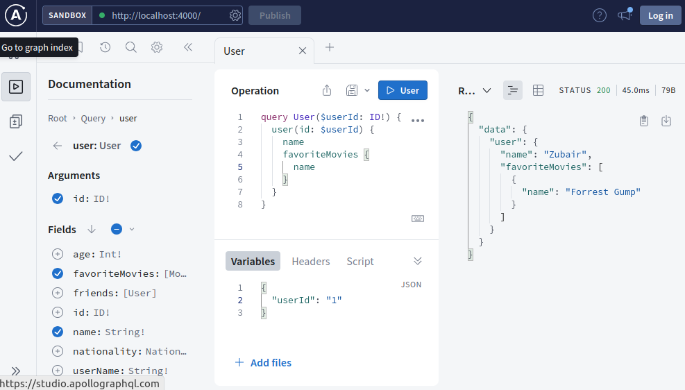

# Defining Queries Part 04

1. Once you have completed [Defining Queries 03](../step07e_defining_queries_resolvers_03) run the following in two different terminals

   ```bash
   tsc -w
   ```

   ```bash
   npm start
   ```

2. Update `src/schema/typeDefs.ts`. Add follwoing to the user type

   ```graphql
   favoriteMovies: [Movie]
   ```

   This adds a field to user type which returns a list of movies.

3. Update `src/resolvers/resolvers.ts` and add following to resolvers

   ```ts
   User: {
     favoriteMovies: (_: any) => {
       const filteredMovies = movieList.filter((movie) => {
         if (movie.id !== _.id) {
           return false;
         }
         return true;
       });
     return filteredMovies;
     },
   }
   ```

This resolvers gets the favoriteMovies from the data for a user

7. After all the changes we made, `schema` should look like this

   ```ts
   export const typeDefs = `#graphql
   
       type User {
       id: ID!
       name: String!
       userName: String!
       age: Int!
       nationality: Nationality!
       friends: [User]
       favoriteMovies: [Movie]
       }
   
       type Movie {
           id: ID!
           name: String!
           yearReleased: Int!
           isInTheaters: Boolean!
       }
   
       type Query {
       users: [User!]!
       user(id: ID!): User
       movies(id: ID, name:String, yearReleased:Int, isInTheaters:Boolean): [Movie]
       }
   
       enum Nationality {
           PAKISTAN
           CHINA
           INDIA
           USA
           CANADA
       }
         
   `;
   ```

8. After all the changes we made, `resolvers` should look like this

   ```ts
   import { movieList, usersList } from "../data/data.js";

   export const resolvers = {
     Query: {
       users: () => usersList,

       user: (_: any, args: { id: string }) =>
         usersList.find((user) => user.id === args.id),

       movies: (
         _: any,
         args: {
           id?: string;
           name?: string;
           yearReleased?: number;
           isInTheaters?: boolean;
         }
       ) => {
         if (Object.values(args).every((value) => value === undefined)) {
           return movieList;
         }
         const filteredMovies = movieList.filter((movie) => {
           if (args.id && movie.id != args.id) {
             return false;
           }
           if (
             args.name &&
             !movie.name.toLowerCase().includes(args.name.toLowerCase())
           ) {
             return false;
           }
           if (args.yearReleased && movie.yearReleased !== args.yearReleased) {
             return false;
           }
           if (
             args.isInTheaters !== undefined &&
             movie.isInTheaters !== args.isInTheaters
           ) {
             return false;
           }
           return true;
         });
         return filteredMovies;
       },
     },

     User: {
       favoriteMovies: (_: any) => {
         const filteredMovies = movieList.filter((movie) => {
           if (movie.id !== _.id) {
             return false;
           }
           return true;
         });
         return filteredMovies;
       },
     },
   };
   ```

9. Navigate to http://localhost:4000/ in the browser and run the query as follows

   
